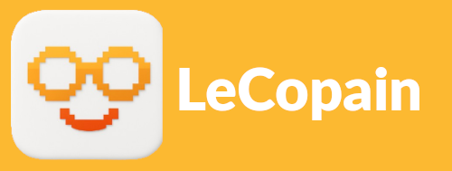
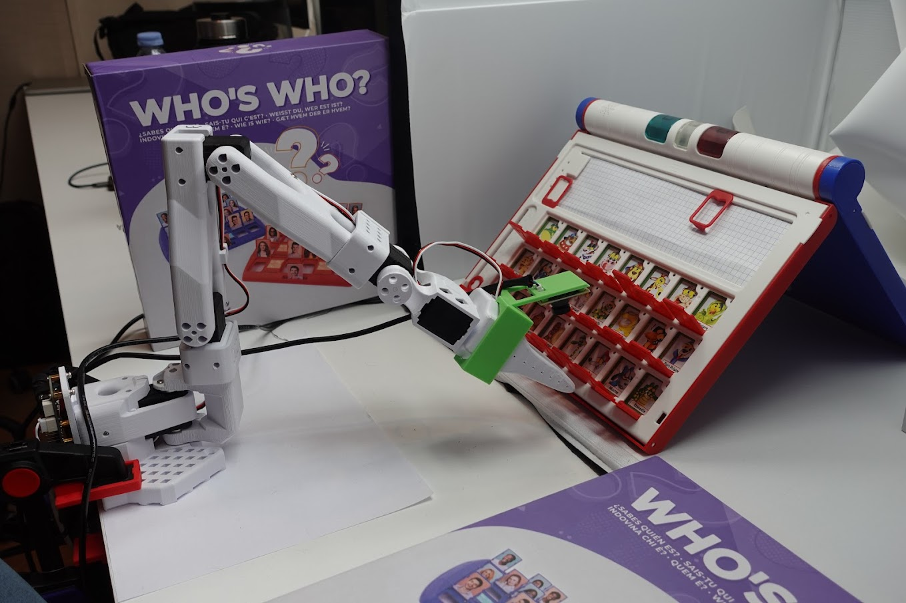

# LeCopain: The Board Game Companion Robot

<p align="center">
  <picture>
    
  </picture>
  <br/>
  <br/>
</p>

<div align="center">

[](https://www.python.org/downloads/)
[](https://github.com/alexcbb/LeCopain/main/LICENSE)
[](https://github.com/alexcbb/LeCopain/blob/main/CODE_OF_CONDUCT.md)


</div>

Welcome to LeCopain, an ambitious project aimed at creating a versatile robot capable of playing any board game with humans. LeCopain combines advanced natural language processing, speech interfaces, and robotic control to deliver an engaging and interactive gaming experience. Initially developed to play "Guess Who?", our vision is to expand LeCopain's capabilities to encompass a wide range of board games, making it the ultimate gaming companion.

<p align="center">
  <picture>
    
  </picture>
  <br/>
  <br/>
</p>

## 🧠 Project Vision
LeCopain is more than just a robot; our goal is to create a system that can understand, reason, and interact with any board game, providing endless hours of entertainment and engagement. Whether it's strategy games, puzzle games, or classic family games, LeCopain aims to be your go-to gaming partner.

## 🎲 Current Game: Guess Who?
As a starting point, LeCopain has been designed to play the classic board game "Guess Who?". This two-player guessing game involves selecting a mystery character and asking yes/no questions to eliminate candidates until only one remains. LeCopain uses animals as characters, making the game visually and semantically engaging for a robotic system.

## 🛠️ System Components
1. **User Interface & Avatar**:
   - Natural voice interactions through a microphone and speaker.
   - Custom 2D animated avatar for visual feedback, enhancing the sense of personality and presence.
2. **Speech-to-Text and Text-to-Speech**:
   - Real-time speech-to-text using Whisper by OpenAI.
   - Text-to-speech synthesis for spoken conversations, making the game accessible for players with limited mobility.
3. **Cognitive Model**:
   - Mistral AI's open-source small model for interpreting user input and deciding game actions.
   - Supports image-based and text-based prompting, returning structured JSON outputs for downstream control decisions.
4. **Robotic Control**:
   - LeRobot library from Hugging Face for executing physical actions.
   - Custom ACT policy with a conditioning layer for grid position input, enabling a single policy model to generalize to all possible board actions.

## 📊 Data Collection
To train the ACT policy, we extended LeRobotDataset to include grid ID input and collected 96 trajectories, covering each grid cell from left-to-right, top-to-bottom. This dataset is available on our [Guess Who datasets](https://huggingface.co/roboticshack) page. Further training will be needed for robust deployment in more complex environments and for additional games.

## 🎉 Future Ambitions
Our ultimate ambition is to expand LeCopain's capabilities to play any board game. This involves:
- **Game Agnostic Design**: Developing a modular and adaptable system that can be easily configured for different board games.
- **Advanced Reasoning**: Enhancing the cognitive model to handle complex game rules and strategies.
- **Expanded Datasets**: Collecting and training on diverse datasets to cover a wide range of board games.
- **Community Contributions**: Collaborating with the community to integrate new games and improve existing functionalities.

## 🎥 Demo Video
See LeCopain in action playing "Guess Who?": [Demo Video](https://www.youtube.com/watch?v=h5zbnq660bo)

## 💻 Code Release & Call for Contributors
We’ve open-sourced the project and are excited to keep building this idea with the community. If you're passionate about AI, robotics, games, or accessibility, we’d love to collaborate!

📧 Interested in contributing or collaborating? Reach out to us at alexandre.chapin@ec-lyon.fr

## 🔧 Getting Started
To get started with LeCopain, follow these steps:

1. **Clone the Repository**:
   ```bash
   git clone --recurse-submodules https://github.com/alexcbb/LeCopain
   cd LeCopain
   ```
   Do not forget to change the branch from the submodule `lerobot` to `lecopain`:
   
   ```bash
   cd lecopain/lerobot
   git checkout lecopain
   ```


2. **Install Dependencies**:
   System dependencies:
   ```bash
    sudo apt-get update
    sudo apt-get install -y --no-install-recommends \
        wget \
        curl \
        gnupg \
        unzip \
        ffmpeg \
        libsndfile1 \
        build-essential \
        cmake
   ```

   Python dependencies (backend):
   ```bash
   conda create --name "lecopain" python>=3.10
   conda activate lecopain
   cd lecopain/guess_who/backend
   pip install -r requirements.txt
   cd ../../lerobot
   pip install --no-cache-dir -e ".[feetech]"
   cd ..
   ```

   Front installation:
   ```bash
    cd guess_who/front
    npm install
   ```

   Set mistral-api key:
   ```bash
   export MISTRAL_API_KEY=<your-api-key>
   ```

3. **Run the Project**:
    In a first terminal, execute the front-end (for the user-interface):
   ```bash
   cd lecopain/guess_who/front/
   npm run dev
   ```

   After pluging both robots arms, do not forget to set the port as sudo
   ```bash
    sudo chmod 666 /dev/ttyACM0
    sudo chmod 666 /dev/ttyACM1
   ```

   In a second terminal execute the backend:
   ```bash
   cd lecopain/guess_who/backend/
   uvicorn src.main:app --host 0.0.0.0 --port 8000 --reload
   ```

## 📜 License
This project is licensed under the MIT License. See the [LICENSE](LICENSE) file for details.

## 🤝 Acknowledgments

We would like to extend our heartfelt thanks to the incredible team that contributed to LeCopain during the Mistral AI Robotic Hackathon [Arthur Haffemayer](https://www.linkedin.com/in/arthur-haffemayer/), [Thomas Gossard](https://www.linkedin.com/in/thomas-gossard-6266b215b/) aka "Le T", [Thomas Gossin](https://www.linkedin.com/in/thomas-gossin/) aka "Le G", [Paul Chu](https://www.linkedin.com/in/paul-chu-paris/) and [Alexandre Chapin](https://www.linkedin.com/in/alexandre-chapin/). Your dedication, creativity, and hard work made this project a success. Special thanks to Mistral AI and all the other partners of this incredible event!

## 📚 Citation

If you use LeCopain in your research or projects, please cite our work:

```
@misc{lecopain2025,
  author = {Alexandre Chapin, Arthur Haffemayer, Paul Chu, Thomas Gossard, Thomas Gossin},
  title = {LeCopain: The Ultimate Board Game Companion Robot},
  year = {2025},
  publisher = {GitHub},
  journal = {GitHub repository},
  howpublished = {\url{https://github.com/alexcbb/LeCopain}}
}
```
Join us in making LeCopain the ultimate board game companion! Your contributions and ideas are welcome as we strive to create a robot that can play any board game with you.

## 📋 To-Do List
- [] Split the READMEs per game (for installation & setup)
- [] Setup a proper installation pipeline
- [] Collect new data
- [] Explore chess game
- [] Explore tic tac toe game
- [] New ideas ??